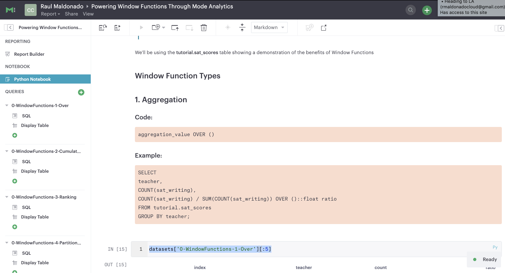

# Window Functions Tips and Resources

## Demo 1

You can find it [here](WindowFunctionsTutorialMode.ipynb)
### Introduction

Window functions are a type of calculation across a set of table rows. Window functions provide the ability of going through with calculation without having to group by and then do an aggregation compression, but rather doing the aggregation without consolidating the grouped set of rows/values.

As a more specified defintion [here](https://www.postgresql.org/docs/9.1/tutorial-window.html)

> "A window function performs a calculation across a set of table rows that are somehow related to the current row. But unlike regular aggregate functions, a window function does not cause rows to be grouped into a single output row--the rows retain separate identifies with aggregation"

We'll be using the **tutorial.sat_scores** table showing a demonstration of the benefits of Window Functions

#### Resources
https://www.postgresql.org/docs/9.1/tutorial-window.html
